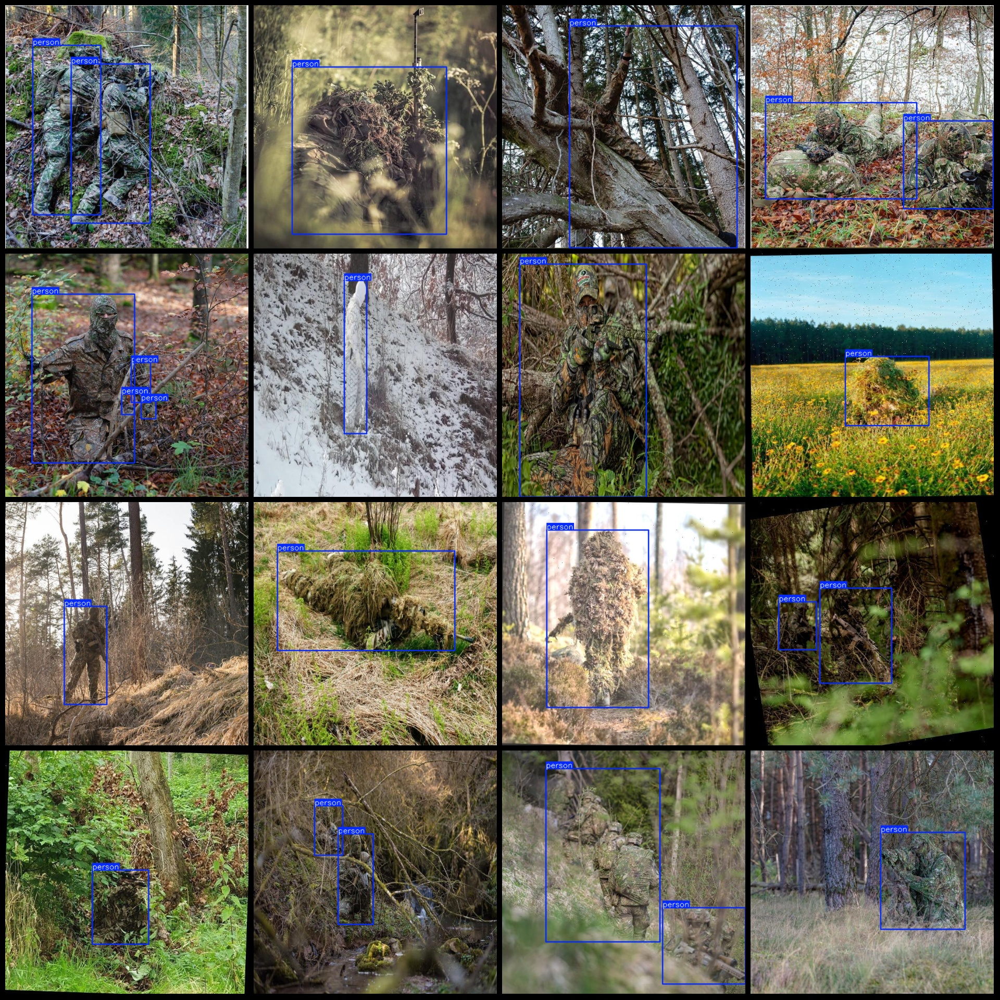
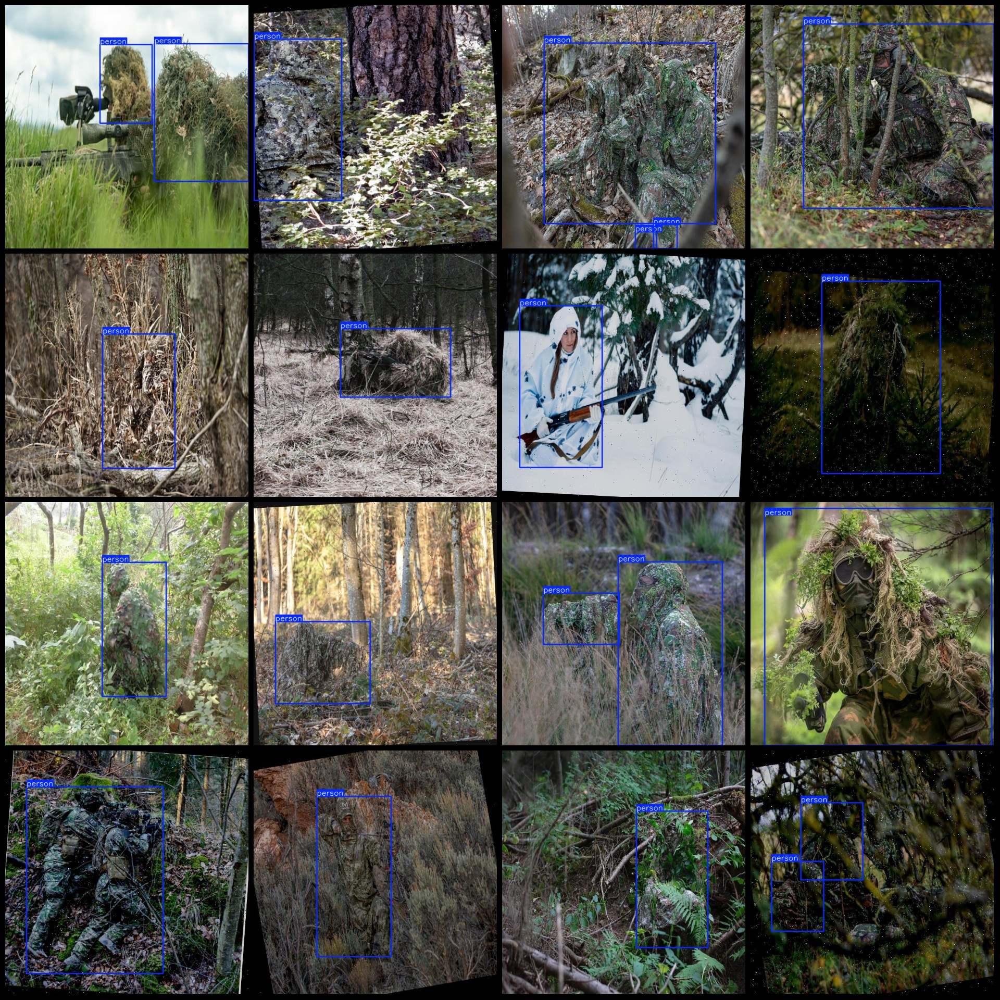

# MIL-Simulated Targets Dataset with VOC+YOLO format and 839 images for 1 category

Pay attention to the dataset, some of which have image enhancement.

Dataset format: Pascal VOC format+YOLO format (without split path's txt file, just contain jpg image and corresponding VOC format xml file and yolo format txt file).

Number of images (jpg file count): 839
Number of annotations (xml file count): 839
Number of annotations (txt file count): 839
Number of annotation categories: 1
Annotation category names: ["person"]
Number of boxes per category:
Person box count = 1099
Total boxes = 1099
Number of images per person category:
Person images = 839
Image resolution: 640x640
Annotation tool used: labelImg
Annotation rules: Draw rectangular boxes for each category.
Important note: The dataset does not have separate training validation test sets to be split.
Special statement: This dataset does not guarantee the accuracy of the trained models or weight files.
Preview of the image:
## Image

Here is a pay link on Stripe ( https://buy.stripe.com/3cs8yP7sY87d0vu9AB ). Please contact me lonlonago@foxmail.com after funding $89, and I will send you a complete data files , thank you!

